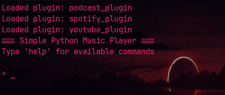
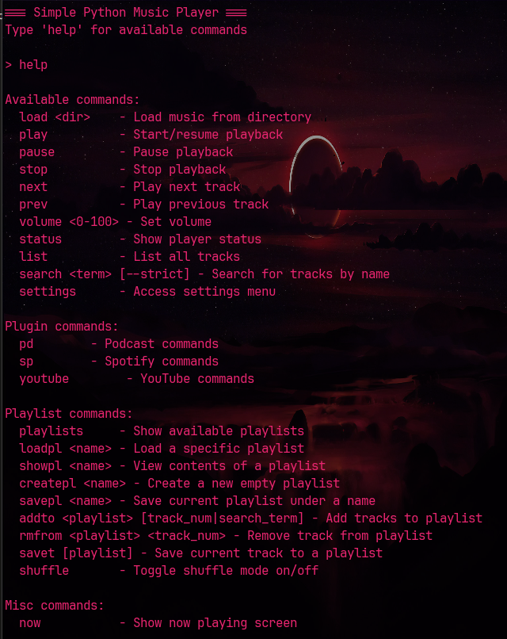
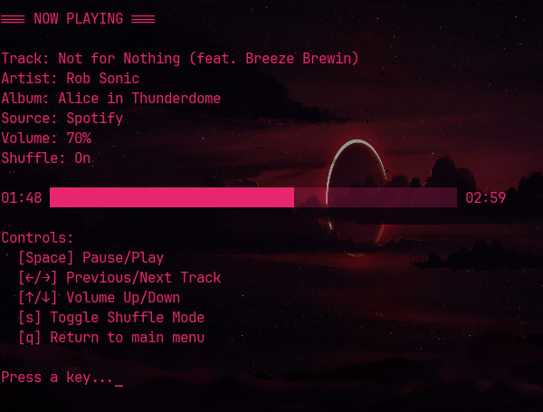

# Shell Shock

Terminal-based (TUI) audio media player with extensible plugin system.



Shell Shock is primarily designed to play local audio files but has a plugin system that allows expanding its capabilities.

Current plugins are:

- Spotify - allows streaming from a spotify premium account.
- Youtube - allows "streaming" of youtube content as audio
- Podcast - allows the downloading of podcasts.

Currently Spotify is fully working, where as the other two are a Work in Progress.

## Installing

Shell Shock uses python 3.12 or greater, and leverages uv

> Install instructions for python and uv, info [here](./docs/python_uv.md)

With python 3.12 and uv installed you simply do the following inside the folder:

1) `uv venv` to create the virtual environment (venv)
2) `.venv\Scripts\Activate` to activate the venv
3) `uv pip install -e .` to install the necessary packages
4) copy the example.env to a new .env file
5) edit the .env file

### .env Configuration

```python
SPOTIFY_CLIENT_ID = ''
SPOTIFY_CLIENT_SECRET = ''
SPOTIFY_REDIRECT_URI = ''

# Set path for music files, for example "C:\code\media\songs"
# Multiple locations just need to be done with commas, full path is not necessary
# Example: photos, music
# Currently subfolders are fine if you set  SCAN_SUBDIRECTORIES
MUSIC_LIBRARY_PATH=

# Enable recursive subdirectory scanning (true/false)
SCAN_SUBDIRECTORIES=True

# Default volume (0-100)
DEFAULT_VOLUME=70

# Default sort order (name, date, random)
DEFAULT_SORT=random

# Autostart with now_playing interface
# Not Implemented
NOW_PLAYING_DEFAULT=True

# Set shuffle mode as default
# Not Implemented
SHUFFLE=True

SPOTIFY_CMD=
PODCAST_CMD=
YOUTUBE_CMD=
```

## Usage

When you have activated the venv simply type `py main.py` to start Shell Shock.

There is a help menu `help` which will show you the commands. Plugins can have their own custom commands and you will see the plugin listed in the help menu dynamically.

> for example: `spotify play` will play a random song, `spotify pause` will pause the song

There is currently a simple settings feature which you will need to use to enable and auto-load plugins.



> Note: you will notice that here it shows `sp` for Spotify, users can modify the command call in the .env

### Now Playing

The `now` command changes the interface to a more conventional media interface



### Playlists

Playlists are currently pretty simple. You can create them in-app and edit them in notepad or in-app.

More to come.

## Plugins

TLDR; plugins inherit from a basePlugin class, most of the heavy lifting has already been written. You will just need to understand the minimum required functionality to write your own.

### Configuring existing plugins

1) Spotify plugin, instructions [here](./docs/spotify_app.md).
2) Youtube plugin, basically works as is. You can change the command from the default `youtube` to anything you want by setting `YOUTUBE_CMD=` whatever you want in the `.env` file.
3) Podcast plugin, basically works as is. You can change the command from the default `youtube` to anything you want by setting `YOUTUBE_CMD=` whatever you want in the `.env` file. You can also set the podcast you want to listen to in the `.env`. Right now it only supports one, WIP.

### Creating your own plugins

Writing your own plugin info [here](./docs/plugins.md).
Plugin template [here](./docs/template_plugin.py).

## ToDo

1) Consolidation of index and config files
2) More in program playlist customization

## File Structure

```python
|   example.env
|   main.py
|   media_index.json
|   plugin_settings.json
|   pyproject.toml
|   README.md  
+---docs
|       1744722706264.png
|       1744722760283.png
|       1744723037671.png
|       python_uv.md 
+---logs
|       application.log  
+---modules
|   |   cli.py
|   |   logging_utils.py
|   |   media_handler.py
|   |   player.py
|   |   playlist_handler.py
|   |   plugin_manager.py
|   |   spotify.py
|   
+---playlists
+---plugins
|   |   podcast_plugin.py
|   |   spotify_plugin.py
|   |   youtube_plugin.py
|   |   __init__.py
+---podcast_downloads
+---youtube_downloads

```

.
